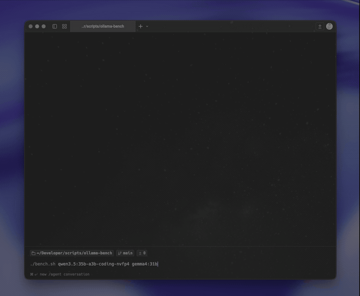

<p align="center">
  <picture>
    <source media="(prefers-color-scheme: dark)" srcset="assets/logo-dark.svg">
    <source media="(prefers-color-scheme: light)" srcset="assets/logo-light.svg">
    
  </picture>
</p>

<h1 align="center">ollama-bench</h1>

<p align="center">
  <a href="LICENSE"></a>
</p>

Benchmark Ollama models on **your** prompts, on **your** hardware.

Generic benchmarks tell you which model is fastest on someone else's workload. `ollama-bench` lets you write a prompt that looks like your real work -- a coding task, a review, a translation, an agent loop -- and compare models on exactly that. In under a minute you know which model actually fits your use case.

<p align="center">
  
</p>

## Create a Benchmark in Seconds

Drop a prompt into a folder and run it:

```bash
mkdir -p benchmarks/my-task
echo "Your prompt here..." > benchmarks/my-task/prompt.txt

./bench.sh -b my-task qwen3.5:35b-a3b qwen3-coder:30b
```

That's it. `ollama-bench` runs each model multiple times, collects timing metrics, and generates a Markdown report with leaderboards so you can compare side by side.

## Installation

**Prerequisites:** [Ollama](https://ollama.com), `jq`, `curl`, `bc` (pre-installed on most macOS/Linux systems).

```bash
git clone https://github.com/kristianbonnici/ollama-bench.git
cd ollama-bench
chmod +x bench.sh
```

Verify it works:

```bash
./bench.sh --list
```

## Usage

```bash
# Run all benchmarks against one or more models
./bench.sh qwen3.5:35b-a3b qwen3-coder:30b

# Run a specific benchmark
./bench.sh -b fastapi-endpoint qwen3.5:35b-a3b

# More iterations for tighter statistics
./bench.sh -n 5 qwen3.5:35b-a3b

# Benchmark against a remote Ollama server
./bench.sh --host 192.168.1.100:11434 qwen3.5:35b-a3b

# Regenerate reports from cached results (no inference)
./bench.sh --report all
```

## Adding Your Own Benchmarks

A benchmark is just a folder with a `prompt.txt`:

```text
benchmarks/
└── my-task/
    ├── prompt.txt      # Required: the prompt sent to Ollama
    └── config.json     # Optional: override defaults
```

Optional `config.json` to tune parameters for a specific benchmark:

```json
{
  "seed": 42,
  "temperature": 0,
  "num_predict": 600,
  "num_ctx": 8192
}
```

**Tips for good benchmarks:**
- Use a prompt that resembles your actual work.
- Keep `temperature=0` and a fixed `seed` for reproducible comparisons.
- Set `num_predict` high enough to expose throughput differences.

### Included Examples

- **`fastapi-endpoint`** -- Write a production FastAPI endpoint. A short code-generation task.
- **`debug-async-cache`** -- Find and fix bugs in an async Python cache. A longer code-review task (`num_predict=1200`).

These are starting points. The real value comes from adding prompts that match your workflow.

## Understanding the Results

The repo includes [an example report](results/report-global-summary_example.md) from a real run comparing three models on both included benchmarks. Browse it to see what the output looks like before running anything yourself.

One especially useful comparison in that report is `qwen3.5:35b-a3b-coding-nvfp4` vs `qwen3.5:35b-a3b`. They are roughly the same size, but the NVFP4 variant is much faster on Apple Silicon in Ollama's newer MLX-powered runtime. Ollama has specifically called out this exact Qwen 3.5 35B A3B NVFP4 vs Q4_K_M comparison in its Apple Silicon MLX preview, with bigger gains on M5-family chips thanks to the new GPU Neural Accelerators. That is exactly why personal benchmarking matters: similar models can behave very differently once quantization format, runtime backend, and your hardware are part of the equation.

Reports are saved under `results/` as JSON summaries and timestamped Markdown files:

```text
results/
├── report-global-summary_example.md
└── fastapi-endpoint/
    └── qwen3.5_35b-a3b/
        ├── run_1.json
        ├── run_2.json
        ├── run_3.json
        └── summary.json
```

### Key Metrics

| Metric | What It Tells You |
| :--- | :--- |
| **TTFT** | Time To First Token. The main number for perceived responsiveness and how fast the model starts answering. |
| **Eval tok/s** | Generation throughput speed. Important for long generations. |
| **Prompt eval tok/s** | How fast the model ingests your prompt. Matters for long contexts. |
| **Total time** | End-to-end latency including load and prompt processing. |

Reports show min, median, mean, and max. **Median** is usually the best comparison number -- it ignores one-off outliers.

### Speed Reference

| Speed (tok/s) | Feels Like | Good For |
| :--- | :--- | :--- |
| `< 5` | Background | Batch jobs, overnight runs |
| `5 - 10` | Usable | Tolerable for chat, but you'll wait |
| `15 - 30` | Comfortable | Interactive chat, Q&A, general use |
| `40 - 60` | Fast | Coding, iterative drafting, debugging loops |
| `100+` | Real-time | Agents, RAG pipelines, voice workflows |

## How It Works

1. Validates that all requested models exist on the Ollama server.
2. Warms each model into memory so timed runs measure inference, not cold loading.
3. Runs each benchmark prompt multiple times per model, saving raw JSON responses.
4. Computes summary statistics and generates ranked Markdown reports.
5. Unloads models between runs to free VRAM.

Defaults are tuned for fair comparison: `temperature=0`, `seed=42`, `num_ctx=8192`, `num_predict=600`, `3` iterations.

## What Affects Speed

- **VRAM** -- If the model fits in GPU memory, expect much better throughput. Spilling to system RAM is a big hit.
- **Quantization** -- Q4 quants are typically much faster than Q8, with a manageable quality tradeoff.
- **Context length** -- Longer contexts slow prompt ingestion and increase total latency.
- **Architecture** -- Two models with the same parameter count can perform very differently.

## License

This project is licensed under the [MIT License](LICENSE).
