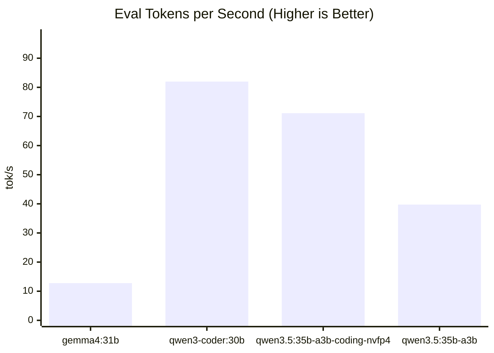
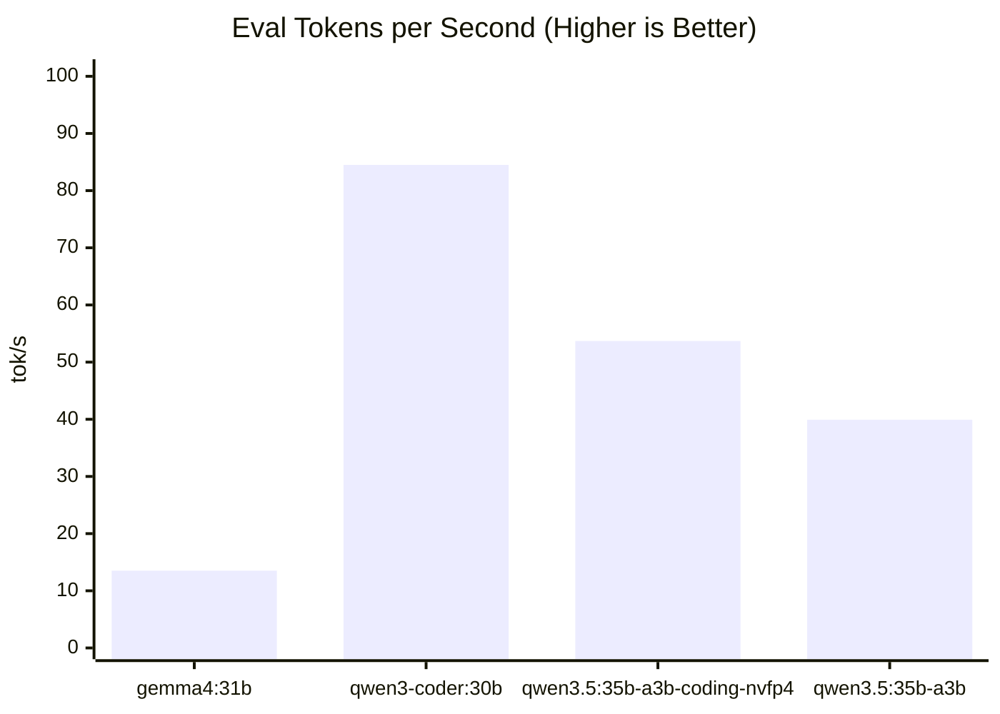

# Benchmark Report

> **Generated:** 2026-04-07 00:37
> **System:** local-machine • Apple M5 Pro • 64GB • macOS 26.4 • Ollama 0.20.0

## Results Summary

Ranked by median eval tokens/sec (averaged across all benchmarks).

| Rank | Model | Params | Quant | Avg tok/s | Avg Total Time |
|:---:|:---|---:|:---|---:|---:|
| 1 | `qwen3-coder:30b` | 30.5B | Q4_K_M | 83.23 tok/s | 7.67s |
| 2 | `qwen3.5:35b-a3b-coding-nvfp4` | 35.1B | nvfp4 | 62.41 tok/s | 12.38s |
| 3 | `qwen3.5:35b-a3b` | 36.0B | Q4_K_M | 39.83 tok/s | 19.71s |
| 4 | `gemma4:31b` | 31.3B | Q4_K_M | 13.15 tok/s | 58.14s |

**Relative:** `qwen3-coder:30b` is **6.32x faster** than `gemma4:31b` (avg eval tok/s)

---

## Benchmark: `debug-async-cache`

> `seed=42 temp=0 predict=1200 ctx=8192` • 3 iterations

| Model | Eval tok/s | Prompt tok/s | Eval Time | Total Time |
|:---|---:|---:|---:|---:|
| `gemma4:31b` | 12.79 | 8322.55 | 79.88s | 82.45s |
| `qwen3-coder:30b` | 81.97 | 42109.56 | 11.39s | 11.65s |
| `qwen3.5:35b-a3b-coding-nvfp4` | 71.13 | 13850.3 | 16.87s | 17.55s |
| `qwen3.5:35b-a3b` | 39.75 | 1852.89 | 30.19s | 31.06s |

## Benchmark: `fastapi-endpoint`

> `seed=42 temp=0 predict=600 ctx=8192` • 3 iterations

| Model | Eval tok/s | Prompt tok/s | Eval Time | Total Time |
|:---|---:|---:|---:|---:|
| `gemma4:31b` | 13.52 | 1074.58 | 33.51s | 33.85s |
| `qwen3-coder:30b` | 84.5 | 5776.9 | 3.57s | 3.7s |
| `qwen3.5:35b-a3b-coding-nvfp4` | 53.7 | 1332.37 | 7.13s | 7.22s |
| `qwen3.5:35b-a3b` | 39.92 | 294.84 | 7.84s | 8.37s |

