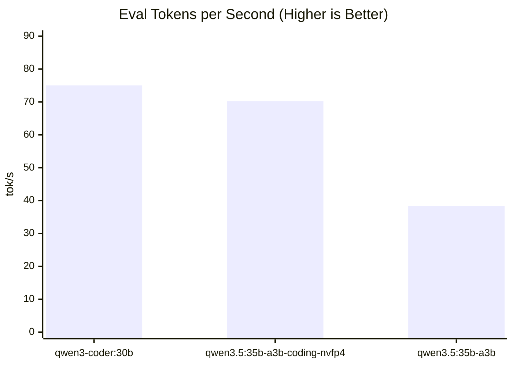
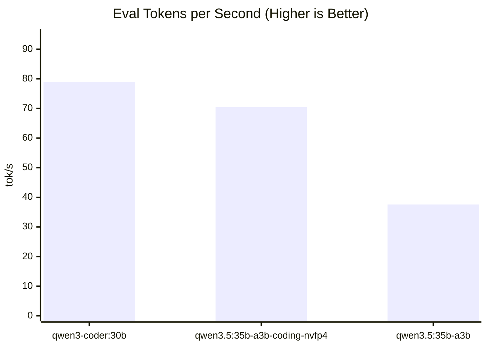

# Benchmark Report

> **Generated:** 2026-04-09 01:37
> **System:** local-machine • Apple M5 Pro • 64GB • macOS 26.4 • Ollama 0.20.2

## Results Summary

Metric definitions:
- **TTFT**: Time To First Token (responsiveness)
- **Eval tok/s**: Generation throughput speed
- **Total Time**: End-to-end execution time

Ranked by median eval tokens/sec (averaged across all benchmarks).

| Rank | Model | Params | Quant | Avg tok/s | Avg TTFT | Avg Total Time |
|:---:|:---|---:|:---|---:|---:|---:|
| 1 | `qwen3-coder:30b` | 30.5B | Q4_K_M | 76.95 tok/s | 0.06s | 8.54s |
| 2 | `qwen3.5:35b-a3b-coding-nvfp4` | 35.1B | nvfp4 | 70.36 tok/s | 0.06s | 11.41s |
| 3 | `qwen3.5:35b-a3b` | 36.0B | Q4_K_M | 37.98 tok/s | 0.41s | 20.59s |
### TTFT Leaderboard

Ranked by median Time To First Token (TTFT), averaged across all benchmarks.

| Rank | Model | Params | Quant | Avg TTFT | Avg tok/s | Avg Total Time |
|:---:|:---|---:|:---|---:|---:|---:|
| 1 | `qwen3.5:35b-a3b-coding-nvfp4` | 35.1B | nvfp4 | 0.06s | 70.36 tok/s | 11.41s |
| 2 | `qwen3-coder:30b` | 30.5B | Q4_K_M | 0.06s | 76.95 tok/s | 8.54s |
| 3 | `qwen3.5:35b-a3b` | 36.0B | Q4_K_M | 0.41s | 37.98 tok/s | 20.59s |

**Relative:** `qwen3-coder:30b` is **2.02x faster** than `qwen3.5:35b-a3b` (avg eval tok/s)

---

## Benchmark: `debug-async-cache`

> `seed=42 temp=0 predict=1200 ctx=8192` • 3 iterations

| Model | Eval tok/s | Prompt tok/s | TTFT | Eval Time | Total Time |
|:---|---:|---:|---:|---:|---:|
| `qwen3-coder:30b` | 75.03 | 39238.64 | 0.06s | 12.36s | 13.12s |
| `qwen3.5:35b-a3b-coding-nvfp4` | 70.25 | 12157.62 | 0.07s | 17.08s | 17.23s |
| `qwen3.5:35b-a3b` | 38.37 | 1783.33 | 0.44s | 31.27s | 32.24s |

## Benchmark: `fastapi-endpoint`

> `seed=42 temp=0 predict=600 ctx=8192` • 3 iterations

| Model | Eval tok/s | Prompt tok/s | TTFT | Eval Time | Total Time |
|:---|---:|---:|---:|---:|---:|
| `qwen3-coder:30b` | 78.87 | 4949.54 | 0.08s | 3.83s | 3.97s |
| `qwen3.5:35b-a3b-coding-nvfp4` | 70.49 | 1961.09 | 0.07s | 5.43s | 5.6s |
| `qwen3.5:35b-a3b` | 37.59 | 285.82 | 0.39s | 8.33s | 8.96s |

